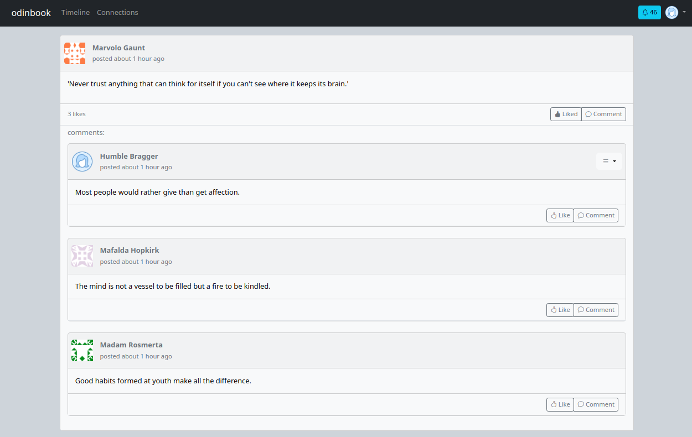
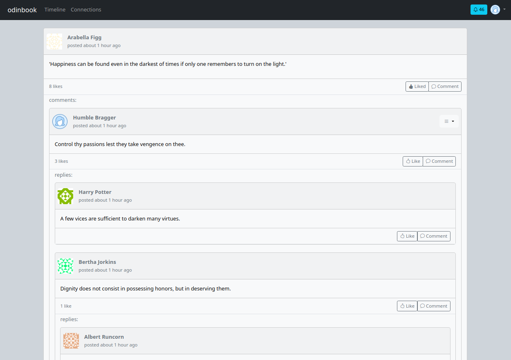
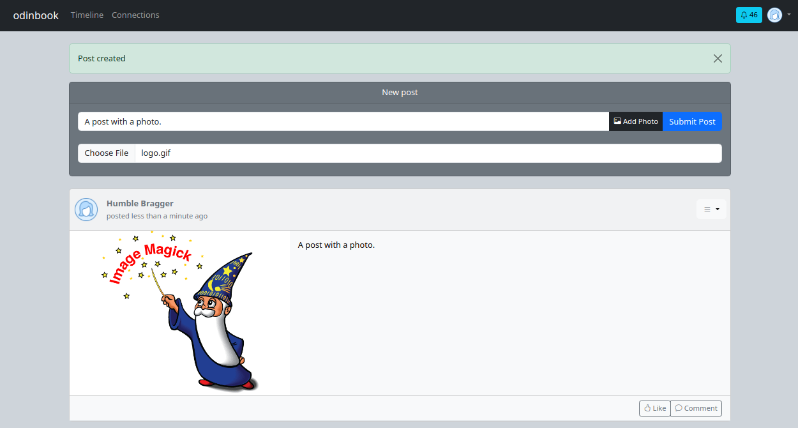
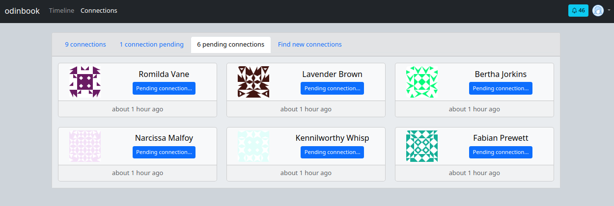
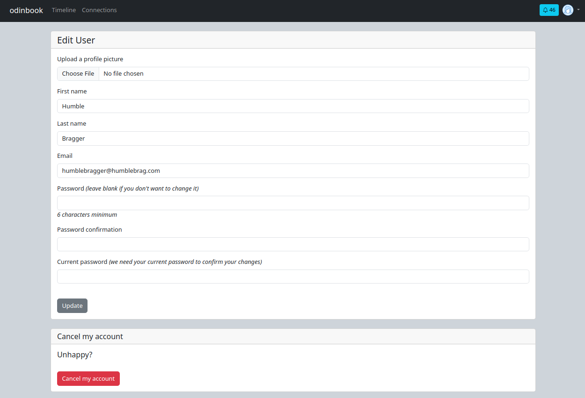
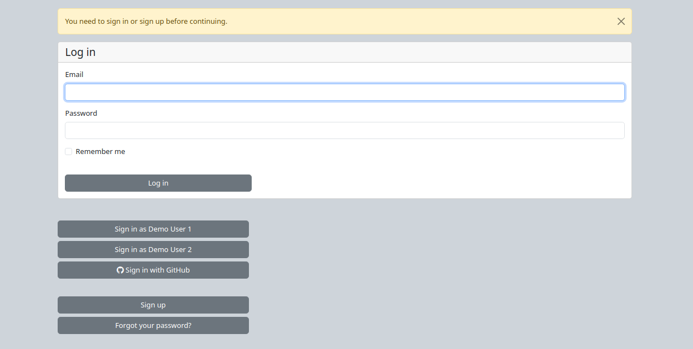
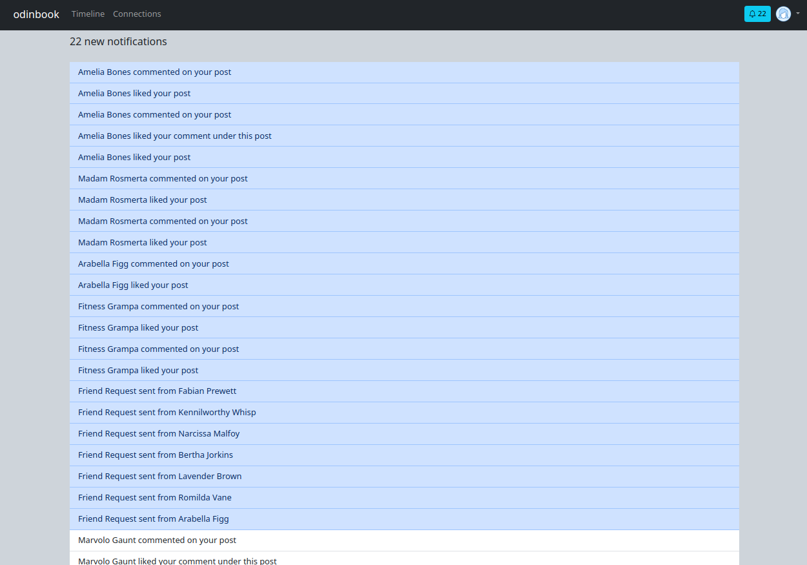

# odinbook

## Project info

This is a simplified social media app meant to tie together the information learned during the rails module of The Odin Project. Project description can be found here:

https://www.theodinproject.com/lessons/ruby-on-rails-rails-final-project

<br>


## Live demo

Available via [Fly.io](https://odin-book-v2.fly.dev/)

<br>


## Features

**Registration**
  * Devise allows users to register or create new sessions
  * OAuth allows users to login with their Github account
  * welcome email is sent when new user is created

<br>

**Profile**
  * users can add first name, last name, and upload a user image (default gravatar image)

<br>

**Posts**
  * users can write posts and upload an image
  * posts can have many likes and comments
  * users can destroy their posts

<br>

**Comments**
  * can have many likes
  * users can reply to others (nested comments)
  * nested comments use turbo streams to avoid page reloads and update post
  * users can destroy their comments

<br>

**Friendship**
  * users can add other users as connections
  * when users are connections, their posts are rendered on eachother's timeline

<br>

**Notifications**
  * notified when a reply is made to a comment
  * notified when comments are made on a post
  * notified when post recives likes
  * notified when a connection is requested and accepted

<br>

**Additional Features**
  * Infinite scroll timeline, notifications, and user page
  * Realtime updates of the timeline via Actioncable
  * Minimal bootstrap styling

<br>


## Known Bugs

* Bootstrap's javascript dropdowns intermittently stop working, requiring a page refresh.

<br>


## Photos

### Post with comments:


<br>

### Post with nested comments:


<br>

### Post with an image:


<br>

### Tabbed user index:


<br>

### User show page with infinite scroll:


<br>

### User edit page, where a user image can be uploaded:


<br>

### Sign in page:


<br>

### User notifications page with infinite scroll:


<br>


## Behind the Scenes

### This app makes use of:
* Ruby version 3.2.2
* Rails version Rails 7.1.2

* PostgreSQL database
* Devise gem for user authentication
* Faker gem to help seed database with fake users and posts
* OmniAuth gem to sign in through Facebook or GitHub
* Bootstrap styling
* Rails credentials to store sensitive information
* Letteropener gem to test emails during development
* Carrierwave for image uploads
* Cloudinary for image hosting
* Fly.io for deployment
* Pagy gem for infinite scroll timeline


### Project Notes
   
**Project Initiation**

  * I initially created this project using the command `rails new odin-book --database=postgresql --css=bootstrap`

  * I found that adding  `--css=bootstrap` changed more files than just adding bootstrap and made the project more difficult to debug.

<br>


**Image Processing**

  * Imagemagick not working properly in development

  * `process resize_to_limit: [400, 400]` working with gif files, but giving an error for jpg and png files.

  * Possible solutions:
    * Try Rmagick instead of minimagick
    * Rollback Imagemagick to version 6.9.10 instead of version 7.1.1

  * ended up processing images through cloudinary

<br>

**Notifications**

  * I would like to display notifications in a modal instead of sending the user to another page, but I cannot figure out how to implement infinite scroll in a module from the nav bar.

  * Currently, the user is redirected to the users/notifications page instead of rendering a modal in order to implement infinite scroll pagination.

  * at first, I couldn't figure out a way to display the modal without the page refreshing once the notifications action was called. 

  * Attempted solution involving adding a route and using `button_to` with `remote: true`, but page still refreshed.

  * Turbo stream was the solution to stop page refresh

<br>


**Development**

* Use `bin/rails s` to view development version of the application.
* Use `fly deploy` to deploy the application. 

<br>

**Deployment**

  * Not necesary to configure app secrets on fly.io website

  * When deploying to fly.io with Rails Credentials, using `Rails.application.credentials.dig(:github, :github_app_id)` worked when `Rails.application.credentials.github.github_app_id` was returning nil. 

  * When taking the app down from fly.io and the depoloying it again, it was important to make sure the following code was included in fly.toml:
      ```
      [deploy]
        release_command = "bin/rails db:prepare"
      ```

  * Deployment with CarrierWave and Cloudinary to fly.io required adding a cache directory in `image_uploader.rb` to resolve profile picture upload issues.

  * Once deployed, I had to follow these instructions with every new terminal window if I needed to deploy changes or interact with fly:

    > flyctl was installed successfully to /home/user/.fly/bin/flyctl
    > Manually add the directory to your $HOME/.bash_profile (or similar):
    > * `export FLYCTL_INSTALL="/home/user/.fly"`
    > * `export PATH="$FLYCTL_INSTALL/bin:$PATH"`

<br>


**Project improvements**

* chat feature implemented with Actioncable (similar implementation to posts on timeline)
* realtime notifications with Actioncable
* A searchbar to find friends.
* Dark mode
* A button to return to the top of the page on paginated pages with infinite scroll.
* Avoid page reloads when friend requests are created, canceled, declined, or accepted with turbo streams
* Update posts on profile pages with Actoncable
* Make post able to be either a text OR a photo by using a polymorphic association (so users can still like or comment on it while being none-the-wiser).
* a basic set of integration tests (not yet complete)

* Sign up for an email provider like sendgrid/Create better email for mailer
* At the time of development, sendgrid and postmark seem to want a domain email to sign up (not gmail), mailgun does not have a free teir, and mailchimmp emails a physical address.

<br>


**Helpful Resources**

* https://medium.com/@aaron.rory.newbold/ruby-on-rails-facebook-implementation-spybook-8c03a0b49b32
  * This blog post was a useful resource when working on associations. 
* https://www.bearer.com/blog/infinite-scrolling-pagination-hotwire
  * This resource was helpful when implementing pagination on various pages. 
* https://github.com/hotwired/turbo-rails/issues/122#issuecomment-783214928
  * This comment helped me get unstuck when I was having trouble with the sign in and registration pages after implimenting pagination with turbo. Turns out, I needed to add `data: { turbo: false }` to those forms. 
* https://cloudinary.com/documentation/rails_carrierwave
  * The cloudinary docs were very helpful when configuring with carrierwave.
* https://medium.com/@adi8090808766/credentials-or-environment-variables-in-ruby-on-rails-371831f2502
  * I referenced this article when setting up credentials
* https://dev.to/morinoko/sending-emails-in-rails-with-action-mailer-and-gmail-35g4
  * This article was helpful when setting up Actionmailer with a Gmail account as an alternative to Sendgrid.
* https://stackoverflow.com/questions/23137012/535-5-7-8-username-and-password-not-accepted
  * This thread helped me configure a GMail account to send emails.
* https://github.com/ryanb/letter_opener/issues/117#issuecomment-611362820
  * This post was helpful when for off emails when seeding during development.

<br>


**Terminal commands used during development**

* `rails new odin-book --database=postgresql `
* `rails generate devise User fname:string lname:string image:string`
* `rails generate controller Users index show`
* `rails generate devise:views`
* `rails generate uploader Image`
* `rails generate model Post content:text user:references`
* `rails generate controller Posts index show new create`
* `rails generate model Comment content:text post:references user:references`
* `rails generate controller Comments new create`
* `rails generate model Like user:references post:references comment:references`
* `rails generate controller Likes create`
* `rails generate model Friendship sent_to:references sent_by:references status:boolean`
* `rails generate controller Friendships create`
* `rails generate model Notification notice_id:integer notice_type:string user:references`
* `rails generate migration AddPostAndCommentReferencesToNotifications post:references comment:references`
* `rails generate migration AddParentIdToComments parent:references`
* `rails generate migration AddViewedToNotifications viewed:boolean`
* `rails generate migration AddOmniauthToUsers provider:string uid:string`
* `rails generate channel post`
* `rails generate mailer WelcomeMailer`
* `rails generate migration AddImageToPosts image:string`
